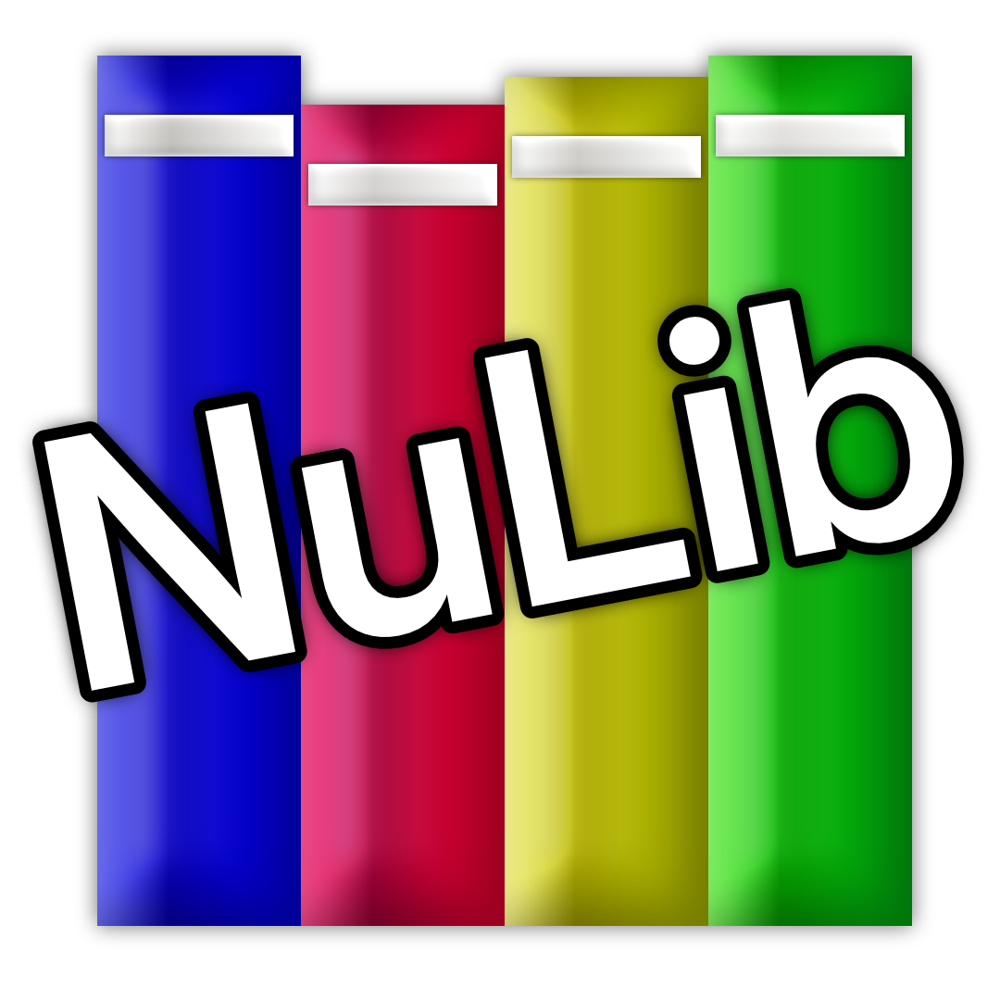

  

# NuLib

NuLib is an alternative standard library for the D Programming Language, this standard library focuses
on allowing use of high level D constructs without a garbage collector. Additionally these constructs try
but are not guaranteed to work with phobos constructs to some extent.

In practice this allows you to write mixed GC and no-gc code depending on your needs at any given time,
with nulib building ontop of `numem` for portability. Additionally nulib can be used with `nurt` to go
fully no-gc; with the alternate runtime providing the core required hooks for many D language features.

## Why NuLib?

D is an amazing language which bridges both high and low level programming, however with how D's runtime
is constructed, it can be difficult to use DLang outside of its own ecosystem; namely because its runtime
and garbage collector makes cross-language interopability difficult.

The Nu series of libraries aim to fill this gap by both providing tools for users of libphobos and the D
ecosystem, and also providing tools for developers who wish to write libraries used from outside of D.

&nbsp;  
&nbsp;  
&nbsp;  

# Project Structure

NuLib, as a standard library is a bit on the complex side; however to make it as usable as possible
even on platforms without direct support, many parts of the standard library utilizes weak symbols
implemented by seperate support packages.

In practice this means that a subset of nulib should work everywhere, even where there's no OS support.
While third party or builtin support packages can provide more parts of functionality, such as shared library
loading support, threads, etc.

Currently the structure is split up as follows:

| Directory  | Description                                                    |
| ---------- | -------------------------------------------------------------- |
| `source/`  | The main interface of the library                              |
| `modules/` | Secondary modules and extensions to nulib                      |
| `os/`      | OS specific implementations for higher level nulib constructs. |

## Adding new OS support modules.
You can incrementally add OS-specific functionality by creating a seperate dub package.  
Every file that has a higher level wrapper over low level concepts, will have hooks defined
in a section denoted with "`FOR IMPLEMENTORS`", implement the hooks as **non-weak** symbols
in your library to add the given functionality.

&nbsp;  
&nbsp;  
&nbsp;  